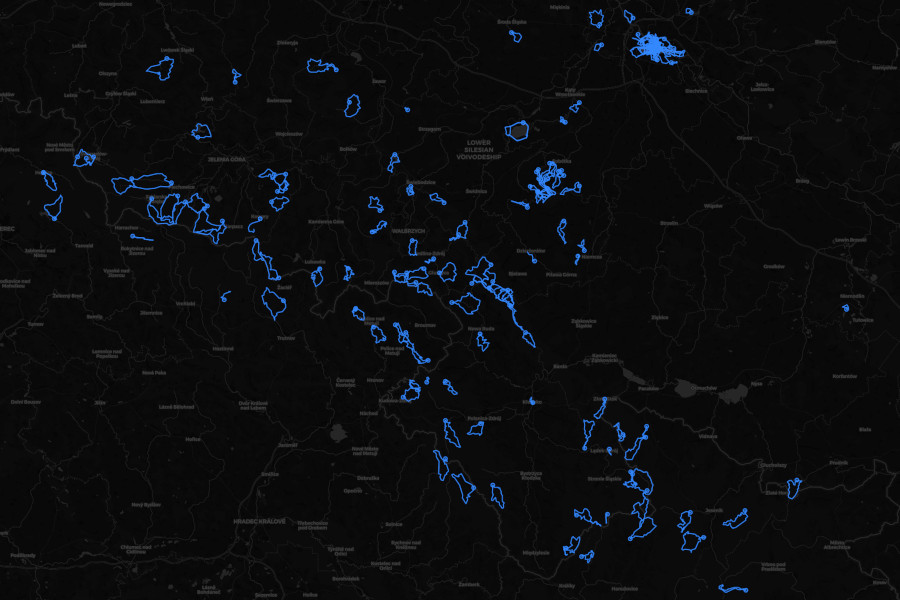

# Otrails

<a href="https://github.com/drmats/otrails/">
    
</a>

Trails. Open.

Parse garmin data export files, download images,
parse [IGC file](https://www.fai.org/sites/default/files/igc_fr_specification_2020-11-25_with_al6.pdf) sets,
store geometries in PostGIS, compute occupied MVT tile coordinates,
bake MVT tiles into MBTile format, serve multiple MBTile data sources,
visualise with MapLibre and more.

Hiking trails, cycling routes, running paths, flight tracks, multiple users - all at once.

<br />

<p align="center">
    
</p>

<br />


## documentation

* [technical intro](./doc/intro.md)
* [resources](./doc/resources.md)

<br />


## quickstart

1) [Export your data from garmin](https://www.garmin.com/en-US/account/datamanagement/exportdata/).

2) Put downloaded _zip_ file into `data/exports` folder in this repository.

3) Add three new _vars_ and build `cli`:
    ```
    yarn vars set exportsDir data/exports
    yarn vars set extractsDir data/garmin
    yarn vars set tilesDir data/tiles
    yarn build:cli
    ```

4) Ingest and process exported garmin data - invoke the following `cli` command:
    ```
    cli ingest-garmin-data [zipFileName] [userShortId]
    ```
    > _(`[zipFileName]` is the name of file downloaded from garmin,_
    > _and `[userShortId]` can be your name or nick, e.g. `bob`)_

5) Ingest and process IGC flights (optional):
    * add new entry to _vars_:
        ```
        yarn vars set flightsDir data/flights
        ```
    * copy your IGC files into `data/flights` subfolder (e.g. `data/flights/solo`)
    * ingest and process igc file set:
        ```
        cli process-igcs solo [userShortId]
        ```

6) "Bake" usable data set:
    ```
    cli setup-views
    cli bake-tiles
    ```

7) Initialize base maps layers:
    ```
    cli prepare-base-maps
    cli init-proxy-tiles open-street-map.raster "https://tile.openstreetmap.org/{z}/{x}/{y}.png"
    ```

8) Add another three _vars_, build and run `service`:
    ```
    yarn vars set serviceDbDir data/service
    yarn vars set servicePort 7777
    yarn vars set staticDir data/static
    yarn build:service
    yarn start:service
    ```

9) Open new terminal console, build and run `web`:
    ```
    yarn build:web
    yarn start:web
    ```

10) Open [http://localhost:8000/](http://localhost:8000) in your web browser.

<br />


## tinkering in pgadmin

Install and open [pgAdmin](https://www.pgadmin.org/), connect it to
`otrails-postgis` database, open _Query Tool_, run
[hikesAndWalks.sql](./doc/hikesAndWalks.sql) example query
and open _Geometry Viewer_.
