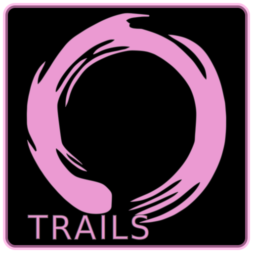

# Otrails

Trails. Open.

<br />

<p align="center">
    
</p>

<br />


## quickstart

### dependencies

* install **[podman](https://podman.io/)** on your system - this is the only
    system-wide depencency (follow
    [official installation instructions](https://podman.io/docs/installation),
    [Red Hat podman-mac article](https://www.redhat.com/sysadmin/run-containers-mac-podman)
    or [Red Hat podman-windows article](https://www.redhat.com/sysadmin/run-podman-windows))

### containers

* create and start [PostGIS](https://hub.docker.com/r/postgis/postgis)
    container - follow a _very short_ instructions in the **quickstart** section in
    [**Containerized PostgreSQL/PostGIS**](./doc/postgres.md) document
* pull [node](https://hub.docker.com/_/node) image - follow
    _even shorter_ instructions in the **quickstart** section in
    [**Containerized Nodejs**](./doc/nodejs.md) document

<br />


## virtual environment

This project relies on tools installed within containers (`node`, `yarn`,
`postgresql`), so in order to ease the development process a python-like
["virtualenv" script is provided](./.venv), with all paths and command
alias definitions (`bash` and `zsh` compatible).

Please make sure you're in the **repository root** directory and have `podman`
command available (`podman --version` should print `podman version x.x.x`).

### enable

Open terminal inside project directory and type:

```bash
. ./.venv
```

> In order to interact with the project you should invoke above command **once
> per every new terminal session** (new terminal window, new tmux pane etc.).

### check

* `node -v` (should print `v20.11.0`)
* `npm --version` (should print `10.2.4`)
* `yarn --version` (should print `1.22.19`)
* `psql --version` (should print
    `psql (PostgreSQL) 16.1 (Debian 16.1-1.pgdg110+1)`)

<br />


## package management

Project uses `workspaces` and it's packages are currently managed with
[`yarn-classic`](https://classic.yarnpkg.com/en/docs) (which is provided
with [node](https://hub.docker.com/_/node) container image).

In order to install or update packages needed by project, open terminal
inside repository root and type:

```bash
yarn
```

> Don't forget about enabling **virtual environment** first.

<br />


## vs code workspace for development

Open `.vscode/otrails.code-workspace` file.

<br />


## command line interface

Basic tool for testing, prototyping, running tasks and interactive development
is maintained in [`packages/cli/`](./packages/cli/) project directory.

* continuous build (watches project files and automatically rebuild on change)
    ```
    yarn dev:cli
    ```
* typecheck and lint
    ```
    yarn test:cli
    ```
* production build
    ```
    yarn build:cli
    ```
* running
    ```
    cli --help
    ```
    ```
    cli <command>

    Commands:
    cli hello                         database connection and versions
    cli dev [cwd]                     development console

    Options:
    --version  Show version number
    --help     Show help

    Visit https://wchmurach.com.pl/
    ```

<br />


## variables interface

For code-independent variables store (e.g. directory names, hosts, ports,
passwords, etc.) this project uses simple `key-val` mechanism implemented as
[small set of functions](./packages/common/scripts/vars.js) operating on
a single **JSON** file (`data/vars.json`). These variables are meant to be
customizable between environments and - depending on particular scenario - can
be baked into `dist` output files during build process or read dynamically.

* list all variables
    ```
    yarn vars
    ```
* add
    ```
    yarn vars set [KEY] [VAL]
    ```
* remove
    ```
    yarn vars del [KEY]
    ```

<br />


## wrap up

1) Set up database access variables, e.g.:

    ```bash
    yarn vars set dbHost localhost:5432
    yarn vars set dbName otrails
    yarn vars set dbUser robot
    yarn vars set dbPass robot
    ```

2) Either run (in separate terminal) continuous build process (`yarn dev:cli`)
    or build once (`yarn build:cli`).

3) If the development environment is set properly, then invoking `cli hello`
    command should succeed.

### example session

```
cli hello
```
```
database in use: localhost:5432/otrails

app name: @xcmats/otrails-cli-0.0.1
app build: 25836d9-2024-01-30T08:52:02+01:00

executing: 3e62ef052ba57761c6b8.sql
    PostgreSQL 16.1 (Debian 16.1-1.pgdg110+1) on x86_64-pc-linux-gnu
    compiled by gcc (Debian 10.2.1-6) 10.2.1 20210110
    64-bit

executing: c5fd6e9e00b3d255f642.sql
    POSTGIS: "3.4.1 ca035b9"
    PGSQL: "160"
    GEOS: "3.9.0-CAPI-1.16.2"
    LIBXML: "2.9.10"
    LIBJSON: "0.15"
    LIBPROTOBUF: "1.3.3"
    WAGYU: "0.5.0 (Internal)"
```

<br />


## how?

1) [Export your data from garmin](https://www.garmin.com/en-US/account/datamanagement/exportdata/).

2) Put downloaded _zip_ file into `data/exports` folder in this repository.

3) Add two new _vars_:
    ```
    yarn vars set exportsDir data/exports
    yarn vars set extractsDir data/garmin
    ```

4) Rebuild `cli`:
    ```
    yarn build:cli
    ```

5) Invoke the following `cli` commands one-by-one:
    ```
    cli extract-garmin-data [zipFileName] [userShortId]
    cli fetch-images [userShortId]
    cli process-summaries [userShortId]
    cli process-tcxes [userShortId]
    cli process-fits [userShortId]
    cli setup-views
    ```
    > _(`[zipFileName]` is the name of file downloaded from garmin,_
    > _and `[userShortId]` can be your name or nick, e.g. `bob`)_

6) Install and open [pgAdmin](https://www.pgadmin.org/), connect it to
    `otrails-postgis` database, open _Query Tool_, run
    [hikesAndWalks.sql](./doc/hikesAndWalks.sql) example query and open
    _Geometry Viewer_.
